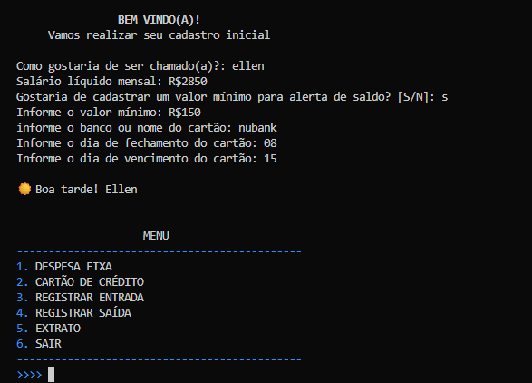
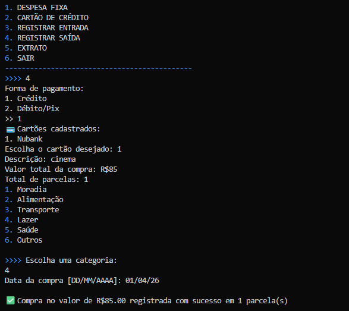
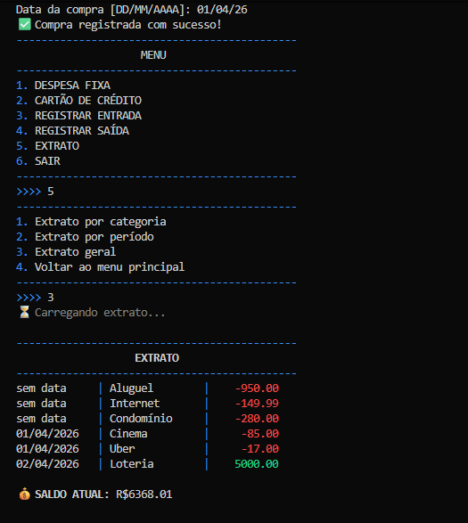

# 💰 Sistema de Controle Financeiro em Python

## 🚀 Sobre o projeto

Este projeto é um sistema de controle financeiro desenvolvido em Python, com foco em simular regras reais utilizadas por aplicativos financeiros.

Diferente de projetos básicos, este sistema implementa lógica de negócio relevante, como controle de faturas de cartão de crédito, parcelamento de compras e organização de transações — aproximando-se de cenários reais do mercado.

---

## 📸 Demonstração

### Menu principal


### Registro de compra no cartão


### Extrato do sistema


---

## 🎯 Objetivo

Construir um sistema funcional enquanto desenvolve habilidades em:

* Lógica de programação
* Modelagem de regras de negócio
* Estruturação de sistemas
* Evolução de código (refatoração)
* Pensamento voltado ao mercado

---

## 🧠 Regras de negócio implementadas

### 💳 Cartão de crédito

* Compras são atribuídas à fatura correta com base na data de fechamento
* Separação automática por mês/ano (`MM/AAAA`)
* Organização de múltiplas faturas por cartão

### 🧾 Parcelamento

* Distribuição automática das parcelas ao longo dos meses
* Controle de número da parcela (`1/12`, `2/12`, etc.)
* Ajuste de centavos para manter consistência do valor total

### 💰 Saldo

* Atualização automática após cada transação
* Integração entre entradas, saídas e cartão

### ⚠️ Alertas

* Aviso de saldo negativo
* Aviso de saldo abaixo do mínimo definido pelo usuário

---

## ⚙️ Funcionalidades

### 👤 Usuário

* Cadastro de nome
* Cadastro de salário
* Definição de valor mínimo para alerta

### 💸 Entradas

* Registro de receitas com data e descrição

### 💳 Saídas

* Débito / Pix
* Cartão de crédito com:

  * Escolha de cartão
  * Parcelamento
  * Associação automática à fatura

### 🏦 Cartões

* Cadastro de múltiplos cartões
* Definição de:

  * Data de fechamento
  * Data de vencimento
* Estrutura de faturas mensais

### 📊 Despesas fixas

* Cadastro de despesas recorrentes
* Inclusão automática no fluxo financeiro

### 📄 Extrato

* Extrato geral
* Filtro por categoria
* Filtro por período
* Ordenação por data

---

## 🖥️ Exemplo de uso

```text
Forma de pagamento:
1. Crédito
2. Débito/Pix

>> 1

💳 Cartões cadastrados:
1. Nubank

Descrição: Mercado
Valor total da compra: R$300
Total de parcelas: 3

📅 Data da compra: 15/03/2026

✅ Compra registrada com sucesso!

Faturas geradas:
04/2026 → R$100.00
05/2026 → R$100.00
06/2026 → R$100.00
```

---

## 🛠️ Tecnologias utilizadas

* Python
* Estruturas de dados (listas e dicionários)
* Manipulação de datas com `datetime`

---

## ▶️ Como executar

1. Clone o repositório:

```bash id="a1s9k2"
git clone https://github.com/EllenKakuta/controle_gastos.git
```

2. Acesse a pasta:

```bash id="q8m4xz"
cd controle_gastos
```

3. Execute:

```bash id="n3p0ld"
python main.py
```

---

## 📂 Estrutura atual

O projeto está estruturado em uma única aplicação (V1), priorizando:

* Clareza de lógica
* Implementação completa das regras de negócio
* Facilidade de evolução futura

---

## 📈 Evolução planejada

* ✅ V1: Sistema funcional com foco em lógica
* 🔜 V2: Refatoração para Programação Orientada a Objetos (POO)
* 🔜 V3: Separação em módulos
* 🔜 V4: Persistência de dados (banco de dados)

---

## 🔥 Decisões técnicas

* Estrutura inicial mantida em um único arquivo propositalmente para focar em lógica
* Uso de dicionários para simular estrutura de dados semelhante a banco
* Separação de responsabilidades por funções
* Evolução planejada em versões (visão de produto)

---

## 💡 Diferenciais

* Simulação de sistema financeiro real
* Implementação de regras complexas (fatura + parcelamento)
* Estrutura pensada para evolução contínua
* Código orientado a regras de negócio (não apenas CRUD)

---

## ⚠️ Pontos de melhoria (próximas versões)

* Refatoração para POO
* Modularização do código
* Persistência de dados
* Interface gráfica ou API

---

## 🧠 Aprendizados

Durante o desenvolvimento deste projeto, foram trabalhados conceitos como:

- Modelagem de regras de negócio
- Manipulação de datas e controle de fluxo temporal
- Organização de dados em estruturas complexas
- Tratamento de erros e validação de entradas
- Simulação de comportamento de sistemas reais

Este projeto marcou a transição de exercícios simples para construção de sistemas mais próximos do mercado.

---

## 👩‍💻 Autora

Desenvolvido por **Ellen Dias** 🚀
Em transição para a área de tecnologia com foco em sistemas, churn e prevenção a fraudes.

---

## 📌 Observação

Este projeto faz parte de uma jornada prática de aprendizado. Cada versão representa evolução técnica e amadurecimento na construção de sistemas mais robustos.


